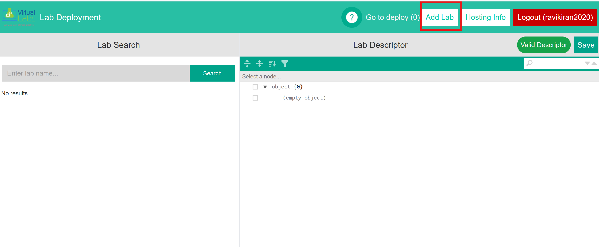

# User Documentation: Hosting of Virtual Labs using deployment tool 

## Introduction

The Virtual Labs Workflow tool streamlines the process of configuring and triggering the deployment of multiple labs. Previously, this was done manually through GitHub, requiring hosting engineers to deploy each lab separately.

## Prerequisites
- Ensure that you have the following before proceeding:
  - A GitHub account with access to the [Virtual Labs GitHub Organisation](https://github.com/virtual-labs).
  - Access to [Virtual Labs GA4 Looker Studio](https://lookerstudio.google.com/) for viewing lab analytics.
  - Access to [Deployment tools](https://deploy.vlabs.ac.in/).

## Target User

This tool is designed for hosting engineers of virtual labs responsible for deploying labs efficiently.

## Lab Deployment Process

Lab deployment involves committing descriptors, selecting workflows, and triggering processes. The Virtual Labs Workflow tool simplifies this by providing an interface for committing and triggering workflows for multiple labs with a single click. Additionally, it displays hosting information for deployed labs.

## Process 

### Creation of Experiment Repos, Lab repo and hosting a lab

**1. Issue Creation:**
- In the Virtual Labs Engineer Forum, create a new issue for the Creation of Experiment Repository(Experiment developer will create this issue)
- To access these issues, visit: [Virtual Labs Engineer Forum Issues](https://github.com/virtual-labs/engineers-forum/issues)

**2. Confirm the Phase while Creating the Experiment Repository:**
- While creating the experiment repository for the lab, ensure that the correct phase is documented and confirmed with the developer. This ensures consistency throughout the lab's lifecycle.
- After creating the experiment repositories comment in issue with the respective experiment links for the lab.
- After the experiment repos are created the developer will develop the experiments and create a hosting request in [engineer forum](https://github.com/virtual-labs/engineers-forum/issues) by creating Github issue to deploy the lab into the AWS.

**3. Creation of Lab repo**
  - In the Virtual Labs Engineer Forum, create a new issue for Hosting/Rehosting of a lab (Experiment developer will create this issue)
  - Will create a lab repo in github based on the hosting request(Github Issue).
  - Add license "GNU Affero General Public License V3.0" under Choose a license dropdown.

**4.	Adding Lab-Descriptor.json file** 
- After creating repo add the “lab-descriptor.json” file. The template is in the [ph3-lab-mgmt](https://github.com/virtual-labs/ph3-lab-mgmt/blob/master/lab-descriptor.json).

Lab-descriptor.json format

~~~
{
    "broadArea": {
        "name": "",
        "link": ""
    },
    "lab": "",
    "lab_display_name": "",
    "deployLab": ,
    "phase": ,
    "collegeName": "",
    "baseUrl": "",
    "introduction": "",
    "experiments": [],
    "targetAudience": {
        "UG": [],
        "PG": []
    },
    "objective": "",
    "courseAlignment": {
        "description": "",
        "universities": []
    }
} 
~~~
**Lab-descriptor.json consists of** 
- broadArea: lab name 
- link: lab link in the vlab.co.in website
- Lab : Name of the lab (Special characters are not allowed)
- Lab display name: Name of the lab where it can have the spl characters and diplayed in the hosted webpage. 
- Deploylab: Boolean make it true to deploy the lab or false to not to deploy the lab.
- Phase: Which phase the lab belongs to.
- College name: The developing institute name in short form as per analytics
- baseUrl: link to the lab
- introduction: it is available in the issue
- experiments: List of all the experiments of the lab will be listed here 
~~~
[{
“name”: “experiment name”
“short-name”: “exp short name”
“repo”: “github experiment repo link”
“tag”: “tag”(v.1.0.3)
“deploy”: Boolean (true or false) if you want to deploy this exp then make it true else make it false.
}]
~~~
- Objective, Course Alignment, Description, Universities will be mentioned in the lab hosting issue. 

**Verify the Lab Phase:**
   - Before deploying a lab, confirm which phase it belongs to and ensure it's being hosted in the same phase.
   
**Check the Hosting Request Issue:**
   - Review the hosting request issue in the engineer forum repository on GitHub. The phase of the lab should be indicated by the developer.
   
**For New Labs (First-Time Hosting):**
   - If it's a new lab being hosted for the first time, ensure that the approval email from IIT Delhi is attached to the GitHub issue.

**For Rehosting (UI or Other Updates):**
   - For rehosting an existing lab, verify its phase by checking the [2020-02-07-AWS-Hosted-Labs](https://docs.google.com/spreadsheets/d/1WXJA_1QkLg-5S0YYBRKyhEXwOgTSbKvm972Fy-thCUc/edit?usp=sharing) Google Sheet. Ensure the lab appears in the correct phase.

**Confirming Lab Phase in Google Analytics:**
   - If the lab is not listed in the 2020-02-07-AWS-Hosted-Labs google sheet, confirm the phase by checking its data in the [GA4 Looker Studio](https://lookerstudio.google.com/u/3/reporting/b40ac724-41f1-4b46-ba1b-c83f65284092/page/sh3VB).

**Clarify with the Developer:**
   - If the lab's phase differs from the expected one, confirm this with the lab's developer before deploying. Correct phase assignment is crucial for accurate phase-based analytics.

## User Interface

**1. Searching Labs and Saving Descriptors**

- **Login:**

  - Users must log in using their GitHub credentials.
  - Upon successful login, the dashboard is displayed.

  

- **Lab Search:**

  - Users can search for labs by name, institute, etc.
  - Clicking on a result loads the lab descriptor on the right half of the container.
  - The descriptor is editable and can be saved using the "Save" button.
  - The "Valid Descriptor" label indicates whether the loaded descriptor is valid.

  

**2. Adding a Lab**

- **Add Lab:**

  - Click on "Add Lab" in the Navbar.
  - In the "Add Lab" modal, enter the lab repository link and click "Load" to load the lab.
  - Click "Add" to include the lab in the "GA4 Lab List."

  

**3. Deploying Labs**

- **Adding Labs to Deploy:**

  - Click on "Add to deploy" to select labs for deployment.

  - Provide necessary information about Hosting Request URL, Hosting Requester, and Hosting Request date.

  
  
  

- **Deployment:**
  - Click on "Go to deploy" in the Navbar.
    
  - Verify details and click "Deploy Labs."
    
    

**4. Hosting Information**

- **Viewing Hosting Information/history:**

  - Click on "Hosting Info" in the Navbar to access deployed labs' information.
  - This shows history of all deployments and helps user gather statistics about the deployments.
  - Apply filters on columns and time to refine the view.

    

**5. Logging Out**

- Click on "Logout" in the Navbar to log out of the application.

## AWS Server Lab Hosting Setup Guide

This is a step-by-step instructions to configure **AWS CloudFront** and **Route 53** for hosting labs.

---

### Steps to Configure

#### 1. Access AWS Console
1. Go to [AWS Management Console](https://console.aws.amazon.com/).
2.  Log in using your AWS credentials.  

#### 2. Configure CloudFront
1. In the search bar, type **CloudFront** and select it.
  
2. The list of CloudFront Distributions will be displayed. Below are the relevant distributions:
   
   - **E1EZV0HOJ842XS** → Phase 2 labs  
   - **E2XT1CMSNG5NJ** → Extended Phase 3 labs (CSE, ECE, MECH)  
   - **E2ILSB88T57Y1G** → Phase 3 labs and other domain labs of extended Phase 3 
   
     
4. Click on the distribution that corresponds to the phase in which your lab is hosted.
5. A list of experiment URLs will appear. Click on the **Edit** button.
    
6. Scroll down and click **Add item**.
   
7. Enter the experiment URL, then scroll down and click **Save Changes**.
    
    

#### 3. Configure Route 53
1. In the search bar, type **Route 53** and select it.
   
2. You will be redirected to the **Route 53 Dashboard**. Click on **DNS Management (Hosted Zones)**.
     
3. In the Hosted Zones list, select **vlabs.ac.in**.
      
4. Click on **Create record**.
   
5. Enter the **Record Name**, then enable the **Alias** option.
    
    
6. Under **Route traffic to**:  
    - Choose **Alias to CloudFront distributions**.
      
     
     
    - The CloudFront distribution options will be displayed when the user clicks on the Choose distribution field. After selecting the appropriate distribution, click Create records
      
      
---

## Verification
Once these steps are completed, the lab hosting setup is finished.  
✅ Verify by accessing the hosted lab through its URL.  

---

## Developer Approval Process
- Add a comment to the lab hosting issue, stating that the lab has been deployed and requesting verification and approval.
- The developer will approve the deployment by responding with a comment on the same issue.

## Linking the lab to vlab.co.in (Only for new labs).
- After receiving approval from the developer, send an email to IITD requesting them to link the hosted lab to vlab.co.in.

  **Mail Format**

-Dear IITD Team, The following  Extended Ph III labs have been hosted on the Common Cloud.  The hosting has been approved by developers. This is a request to IIT Delhi to link the following information on vlab.co.in. 
- Name of the Lab : Lab Name
- Institute:  Institute ID (IIITH,IITK etc)
- Domain:  Dicipline (Computer Science and Engineering, Physical Sciences etc)
- Hosted Url:  Hosted lab url
- Approval Link: Developer approval comment link in github. 

  
