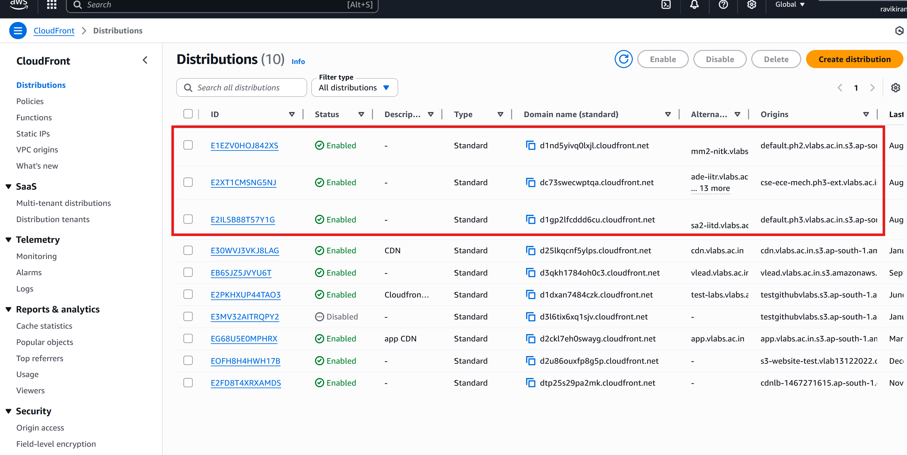
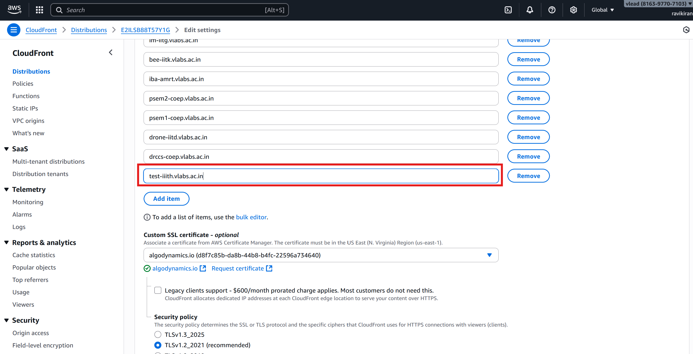
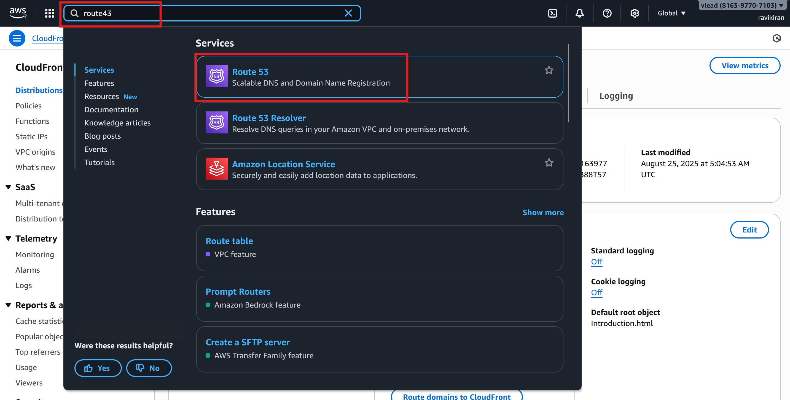
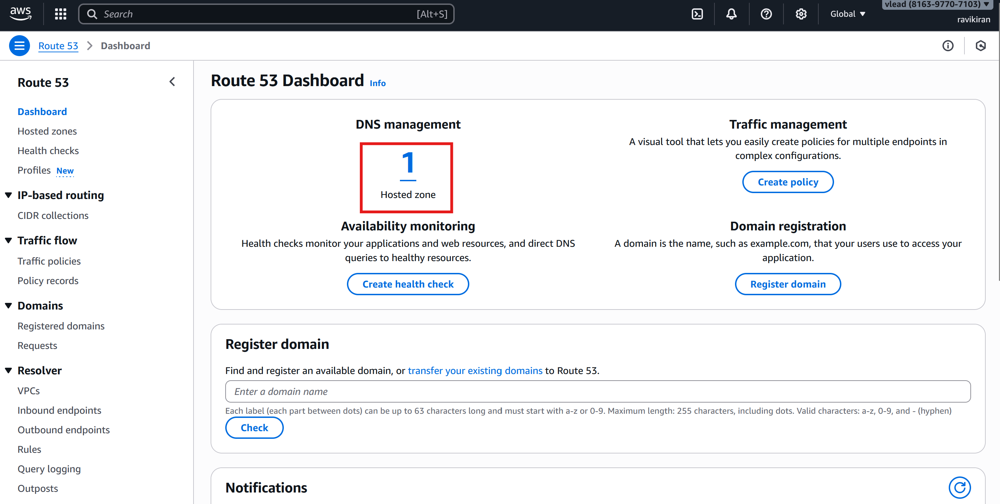

## Hosting a lab that is previously hosted on EC2
If the lab was previously hosted on EC2 and has now been moved to S3, the steps remain the same up to the CloudFront configuration. However, the Route 53 settings need to be updated.

### Steps to Configure

#### 1. Access AWS Console
- Go to [AWS Management Console](https://console.aws.amazon.com/).
- Log in using your AWS credentials.  

#### 2. Configure CloudFront
- In the search bar, type **CloudFront** and select it.
  
- The list of CloudFront Distributions will be displayed. Below are the relevant distributions:
   
   - **E1EZV0HOJ842XS** → Phase 2 labs  
   - **E2XT1CMSNG5NJ** → Extended Phase 3 labs (CSE, ECE, MECH)  
   - **E2ILSB88T57Y1G** → Phase 3 labs and other domain labs of extended Phase 3 
   
     
- Click on the distribution that corresponds to the phase in which the lab is hosted.
- A list of experiment URLs will appear. Click on the **Edit** button.
    
- Scroll down and click **Add item**.
   
- Enter the experiment URL, then scroll down and click **Save Changes**.
    
    

#### 3. Configure Route 53
- In the AWS search bar, type Route 53 and select it.
  

- You will be redirected to the Route 53 Dashboard. Click on DNS Management (Hosted Zones).
  

- From the list of hosted zones, select vlabs.ac.in.
  

- In the search bar, type the URL of the lab that was re-hosted using the Lab Deployment Tool and press Enter.
  

- Select the checkbox next to the record. The record details will be displayed. Click on Edit record.
  

- Ensure that the Alias toggle is enabled.
  
- Under Route traffic to, choose Alias to CloudFront distributions.
- From the dropdown, select the appropriate CloudFront distribution.
- Click Save to apply the changes.
 

## Verification
Once these steps are completed, the lab hosting setup is finished.  
✅ Verify by accessing the hosted lab through its URL.
