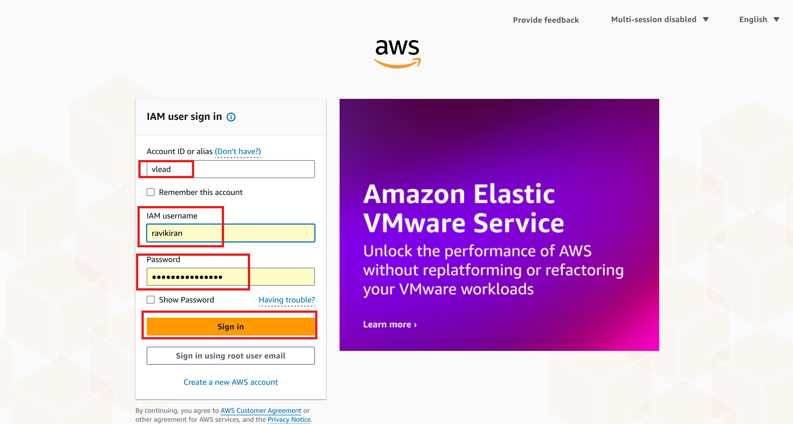
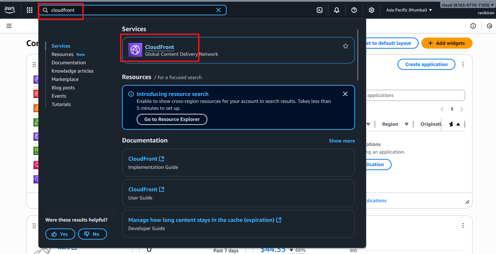
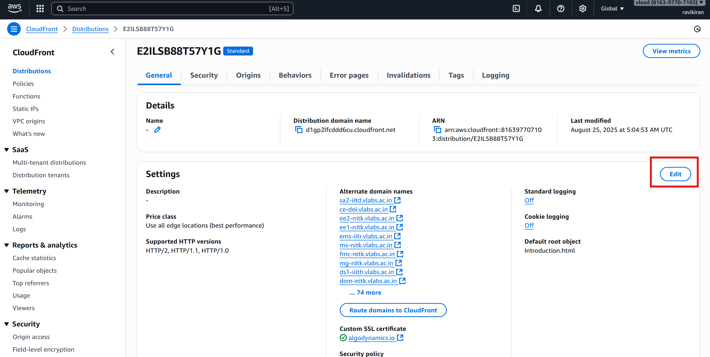
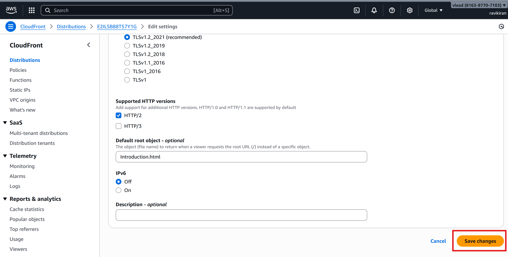

## AWS Server Lab Hosting Setup Guide
### Hosting of new lab on S3

This is a step-by-step instructions to configure **AWS CloudFront** and **Route 53** for hosting labs.

---

### Steps to Configure

#### 1. Access AWS Console
- Go to [AWS Management Console](https://console.aws.amazon.com/).
- Log in using your AWS credentials.  

#### 2. Configure CloudFront
- In the search bar, type **CloudFront** and select it.
  
- The list of CloudFront Distributions will be displayed. Below are the relevant distributions:
   
   - **E1EZV0HOJ842XS** → Phase 2 labs  
   - **E2XT1CMSNG5NJ** → Extended Phase 3 labs (CSE, ECE, MECH)  
   - **E2ILSB88T57Y1G** → Phase 3 labs and other domain labs of extended Phase 3 
   
     
- Click on the distribution that corresponds to the phase in which the lab is hosted.
- A list of experiment URLs will appear. Click on the **Edit** button.
    
- Scroll down and click **Add item**.
   
- Enter the experiment URL, then scroll down and click **Save Changes**.
    
    

#### 3. Configure Route 53
- In the search bar, type **Route 53** and select it.
   
- You will be redirected to the **Route 53 Dashboard**. Click on **DNS Management (Hosted Zones)**.
     
- In the Hosted Zones list, select **vlabs.ac.in**.
      
- Click on **Create record**.
   
- Enter the **Record Name**, then enable the **Alias** option.
    
    
- Under **Route traffic to**:  
    - Choose **Alias to CloudFront distributions**.
      
     
     
    - The CloudFront distribution options will be displayed when the user clicks on the Choose distribution field. After selecting the appropriate distribution, click Create records
      
      
---

