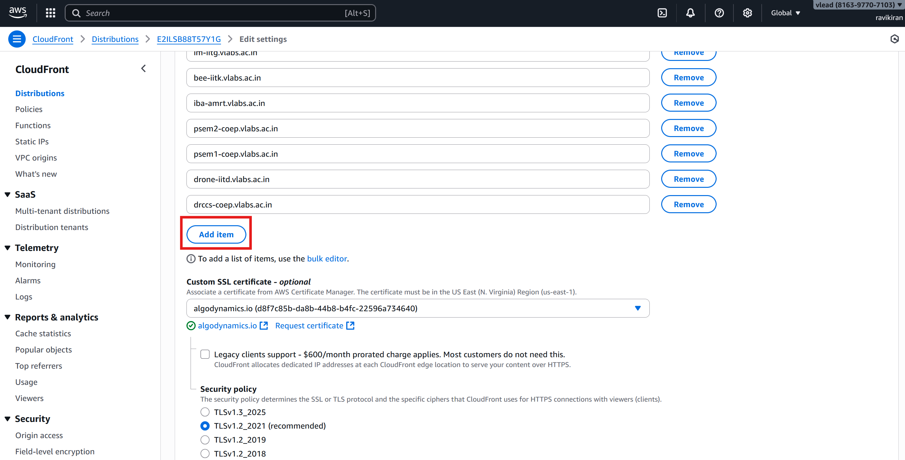
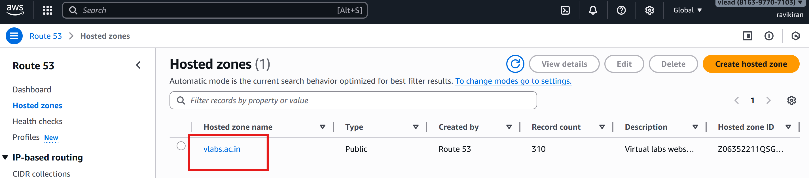
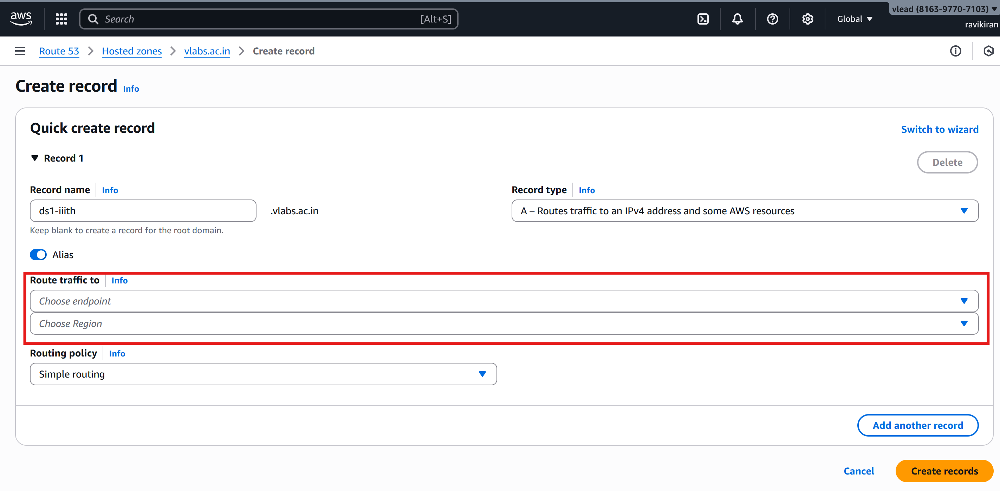
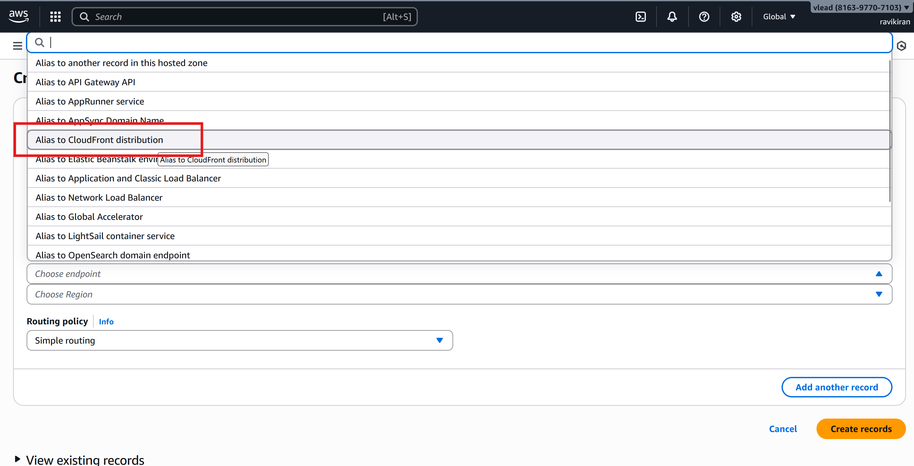

# User Documentation: Hosting of New Virtual Labs using deployment tool & Setup guide

## Introduction  
This guide provides step-by-step instructions for deploying and hosting a new Virtual Lab. The process includes reviewing and analyzing the corresponding [GitHub issue](https://github.com/virtual-labs/engineers-forum/issues), verifying that all prerequisites are met, creating a dedicated GitHub repository for each lab, and running the deployment workflow using the lab deployment tool. With this tool, users can seamlessly host either a single lab or multiple labs as required.  

## Prerequisites
- Ensure that you have the following before proceeding:
  - A GitHub account with access to the [Virtual Labs GitHub Organisation](https://github.com/virtual-labs).
  - Access to [Deployment tools](https://deploy.vlabs.ac.in/).
  - AWS access to the [Virtual Labs](https://console.aws.amazon.com/)
  - User github handle is placed in the [ph3-lab-deploy-s3.yml file](https://github.com/virtual-labs/vlabs-workflows/blob/main/.github/workflows/ph3-lab-deploy-S3.yml) under jobs: workflow_authorization: steps: with: users:. This is mandatory step to trigger the workflow.

## Target User

This tool is designed for hosting engineers of virtual labs responsible for deploying labs efficiently.

## Lab Deployment Process  

The lab deployment process begins when a developer raises an issue in the GitHub Engineers Forum and concludes with sending a request to IIT Delhi to link the lab on [vlab.co.in](https://vlab.co.in). The key steps are as follows:  

1. **Issue Creation** - Developer creates an issue in the [Virtual Labs Engineer Forum Issues](https://github.com/virtual-labs/engineers-forum/issues) requesting lab hosting.
2. **Requirement Verification** - The issue is reviewed and analyzed to ensure all requirements are met.  
3. **Repository Setup** - A dedicated GitHub repository for the lab is created.  
4. **Tool Access** - Log in to the [Lab Deployment Tool](https://deploy.vlabs.ac.in/).  
5. **Adding the Lab** - Add the lab in the deployment tool.  
6. **Deployment Execution** - Deploy the lab using the tool.
7. **Testing the Deployed Lab** – The hosted lab must be thoroughly tested by accessing its website URL to ensure proper functionality and compliance with requirements.
8. **Verification & Approval** - Provide a comment on the GitHub issue with the hosted lab URL and request the developer to verify and approve it.  
9. **Final Linking Reques** - Once approved, send an email to IIT Delhi requesting the lab to be linked on [vlab.co.in](https://vlab.co.in).  

### 1. Issue Creation
- After building the experiment the developer of the lab creates an issue in the [Virtual Labs Engineer Forum Issues](https://github.com/virtual-labs/engineers-forum/issues) requesting lab hosting with all the necessary details like Lab Name, Phase, List of experiments with Name of the experiment, Github repositories link and tags, Approval mail screenshot/attachment from IIT-Delhi, Introduction, Objectives, Course Alignment, Target Audience. Reference this [link](https://github.com/virtual-labs/engineers-forum/issues/1096) for sample issue.

### 2. Requirement Verification
- **Tags**
   - In the gihtub issue list all the experiments must have the valid tags. Check the tags by going to the experiment repo and check the tag is created as mentioned in the issue.

- **Verify the Lab Phase:**
   - Before deploying a lab, confirm which phase it belongs to and ensure it's being hosted in the same phase. Ex: Phase 2, Phase 3, Extended-Phase 3
   - If the lab's phase differs from the expected one, confirm this with the lab's developer before deploying. Correct phase assignment is crucial for accurate phase-based analytics.   

- **For New Labs (First-Time Hosting):**
   - For new lab being hosted for the first time, ensure that the approval email from IIT Delhi is attached to the GitHub issue.
     
**3. Repository Setup or Creation Lab repo**
  - Visit the [Virtual Labs](https://github.com/virtual-labs) Github
    
  - Click on the **Create new dropdown icon** and click on **New repository**
    
  - A new page will open in that under **Configuration** **Start with a template** dropdown select **virtual-labs/ph3-lab-template**
    
  - **Respository name** is the lab name it follows naming convention of lab-lab name-institute short form. For example lab name - **test** and developing institute is **IIIT-Hyderabad** the repo name will be **lab-test-iiith**, Description will be **This repository contains lab content of Test Lab IIITH**. Before clicking on **Create repository** button select the following
      - **Owner** is selected **virtual-labs**
      - Under Configuration **Choose visibility** is **public**
       
   
**About Lab-Descriptor.json file** 
Lab-descriptor.json format

~~~
{
    "broadArea": {
        "name": "",
        "link": "",
        "code":
    },
    "lab": "",
    "lab_display_name": "",
    "phase": ,
    "collegeName": "",
    "baseUrl": "",
    "introduction": "",
    "experiments": [],
    "targetAudience": {
        "UG": [],
        "PG": []
    },
    "objective": "",
    "courseAlignment": {
        "description": "",
        "universities": []
    }
} 
~~~
Use the [Lab description schema](https://github.com/virtual-labs/ph3-lab-mgmt/blob/master/validation/schemas/labDescSchema.json) for filling the details in the lab-descriptor file.

**Lab-descriptor.json consists of** 
- broadArea:
    - "name": Domain of the lab. Visit [vlabs.co.in](https://www.vlab.co.in/) under **Broad Areas of Virtual Labs** click on the domain which the lab belongs to for example **Computer Science & Engineering**. Enter the name of the domain make sure not to enter the special characters. For **Computer Science & Engineering** enter **Computer Science and Engineering**.
 
 
- link: Domain link in the vlab.co.in website for example https://www.vlab.co.in/broad-area-computer-science-and-engineering
- Lab : Name of the lab (Special characters are not allowed)
- Lab display name: Name of the lab where it can have the spl characters and diplayed in the hosted webpage. 
- Deploylab: Boolean make it true to deploy the lab or false to not to deploy the lab.
- Phase: Which phase the lab belongs to 2, 3, "3-ext"
- College name: The developing institute name in short form as per analytics
- baseUrl: link to the lab (name format: short form of lab name-developing institute short form.vlabs.ac.in for example lab name is **test lab** developing institute is **IIIT-Hyderabad** so the base url be **tl-iiith.vlabs.ac.in** all the text should be in small letters.
- introduction: it is available in the github issue created by the developers
- experiments: List of all the experiments of the lab will be listed here 
~~~
[{
“name”: “experiment name”
“short-name”: “exp short name”
“repo”: “github experiment repo link”
“tag”: “tag”(v.1.0.3)
“deploy”: Boolean (true or false) if you want to deploy this exp then make it true else make it false.
}]
~~~
- Objective, Course Alignment, Description, Universities will be mentioned in the github lab hosting issue. 

## User Interface
Go to https://deploy.vlabs.ac.in
**1. Searching Labs and Saving Descriptors**

- **Login:**

  - Users must log in using their GitHub credentials.
  - Upon successful login, the dashboard is displayed.

  

- **Lab Search:**

  - Users can search for labs by name, institute, etc.
  - Clicking on a result loads the lab descriptor on the right half of the container.
  - The descriptor is editable and can be saved using the "Save" button.
  - The "Valid Descriptor" label indicates whether the loaded descriptor is valid.

  

**2. Adding a Lab**

- **Add Lab:**

  - Click on "Add Lab" in the Navbar.
  - In the "Add Lab" modal, enter the lab repository link and click "Load" to load the lab.
  - Click "Add" to include the lab in the "GA4 Lab List."

  

**3. Deploying Labs**

- **Adding Labs to Deploy:**

  - Click on "Add to deploy" to select labs for deployment.
    

  - Provide necessary information about Hosting Request URL(github hosting rquest issue) , Hosting Requester, and Hosting Request date.

  

- **Deployment:**
  - Click on "Go to deploy" in the Navbar.
    
  - Verify details and click "Deploy Labs."
    
    

**4. Hosting Information**

- **Viewing Hosting Information/history:**

  - Click on "Hosting Info" in the Navbar to access deployed labs' information.
  - This shows history of all deployments and helps user gather statistics about the deployments.
  - Apply filters on columns and time to refine the view.

    

**5. Logging Out**

- Click on "Logout" in the Navbar to log out of the application.

## AWS Server Lab Hosting Setup Guide
### Hosting of new lab on S3

This is a step-by-step instructions to configure **AWS CloudFront** and **Route 53** for hosting labs.

### Steps to Configure

#### 1. Access AWS Console
- Go to [AWS Management Console](https://console.aws.amazon.com/).
- Log in using your AWS credentials.  

#### 2. Configure CloudFront
- In the search bar, type **CloudFront** and select it.
  
- The list of CloudFront Distributions will be displayed. Below are the relevant distributions:
   
   - **E1EZV0HOJ842XS** → Phase 2 labs  
   - **E2XT1CMSNG5NJ** → Extended Phase 3 labs (CSE, ECE, MECH)  
   - **E2ILSB88T57Y1G** → Phase 3 labs and other domain labs of extended Phase 3 
   
     
- Click on the distribution that corresponds to the phase in which the lab is hosted.
- A list of experiment URLs will appear. Click on the **Edit** button.
    
- Scroll down and click **Add item**.
   
- Enter the experiment URL, then scroll down and click **Save Changes**.
    
    

#### 3. Configure Route 53
- In the search bar, type **Route 53** and select it.
   
- You will be redirected to the **Route 53 Dashboard**. Click on **DNS Management (Hosted Zones)**.
     
- In the Hosted Zones list, select **vlabs.ac.in**.
      
- Click on **Create record**.
   
- Enter the **Record Name**, then enable the **Alias** option.
    
    
- Under **Route traffic to**:  
    - Choose **Alias to CloudFront distributions**.
      
     
     
    - The CloudFront distribution options will be displayed when the user clicks on the Choose distribution field. After selecting the appropriate distribution, click Create records
      
      
---
## Developer Approval Process
- Add a comment to the lab hosting issue, stating that the lab has been deployed and requesting verification and approval.
- The developer will approve the deployment by responding with a comment on the same issue.

## Linking the lab to vlab.co.in (Only for new labs).
- After receiving approval from the developer, send an email to IITD requesting them to link the hosted lab to vlab.co.in.

  **Mail Format**

-Dear IITD Team, The following  Extended Ph III labs have been hosted on the Common Cloud.  The hosting has been approved by developers. This is a request to IIT Delhi to link the following information on vlab.co.in. 
- Name of the Lab : Lab Name
- Institute:  Institute ID (IIITH,IITK etc)
- Domain:  Dicipline (Computer Science and Engineering, Physical Sciences etc)
- Hosted Url:  Hosted lab url
- Approval Link: Developer approval comment link in github.
