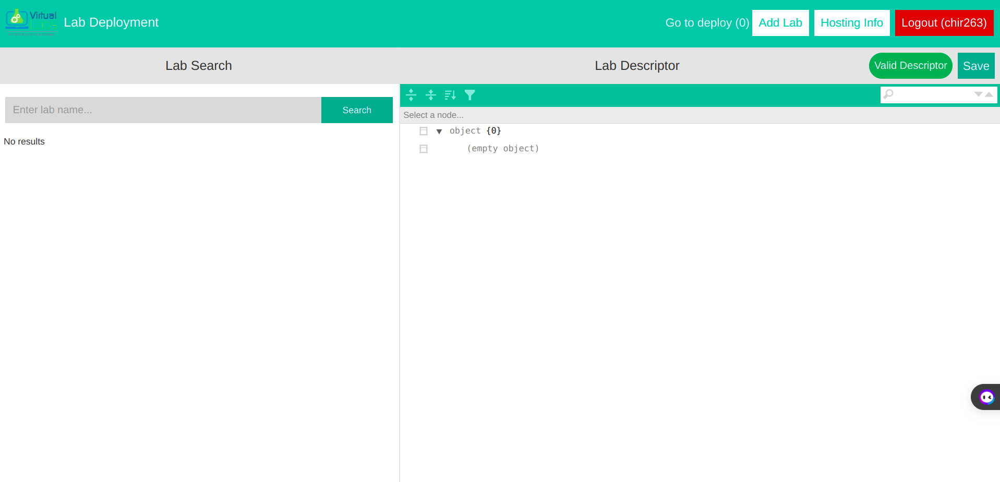
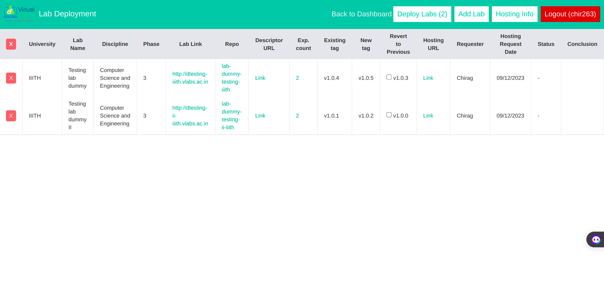

# User Documentation: Re-Hosting of existing Virtual Labs using deployment tool

The Virtual Labs Workflow tool streamlines the process of configuring and triggering the deployment of multiple labs. Previously, this was done manually through GitHub, requiring hosting engineers to deploy each lab separately.

## Prerequisites
- Ensure that you have the following before proceeding:
  - A GitHub account with access to the [Virtual Labs GitHub Organisation](https://github.com/virtual-labs).
  - Access to [Virtual Labs GA4 Looker Studio](https://lookerstudio.google.com/) for viewing lab analytics.
  - Access to [Deployment tools](https://deploy.vlabs.ac.in/).

## Target User

This tool is designed for hosting engineers of virtual labs responsible for deploying labs efficiently.

## Lab Deployment Process

Lab deployment involves committing descriptors, selecting workflows, and triggering processes. The Virtual Labs Workflow tool simplifies this by providing an interface for committing and triggering workflows for multiple labs with a single click. Additionally, it displays hosting information for deployed labs.

## Process 

## User Interface

**1. Searching Labs and Saving Descriptors**

- **Login:**

  - Users must log in using their GitHub credentials.
  - Upon successful login, the dashboard is displayed.

  

- **Lab Search:**

  - Users can search for labs by name, institute, etc.
  - Clicking on a result loads the lab descriptor on the right half of the container.
  - The descriptor is editable and can be saved using the "Save" button.
  - The "Valid Descriptor" label indicates whether the loaded descriptor is valid.

  

  
**2. Deploying Labs**

- **Adding Labs to Deploy:**

  - Click on "Add to deploy" to select labs for deployment.

  - Provide necessary information about Hosting Request URL(github hosting rquest issue) , Hosting Requester, and Hosting Request date.

  

- **Deployment:**
  - Click on "Go to deploy" in the Navbar.
    
  - Verify details and click "Deploy Labs."
    
    

**3. Hosting Information**

- **Viewing Hosting Information/history:**

  - Click on "Hosting Info" in the Navbar to access deployed labs' information.
  - This shows history of all deployments and helps user gather statistics about the deployments.
  - Apply filters on columns and time to refine the view.

    

**4. Logging Out**

- Click on "Logout" in the Navbar to log out of the application.

## Developer Approval Process
- Add a comment to the lab hosting issue, stating that the lab has been deployed and requesting verification.
- The developer will check the deployment by responding with a comment on the same issue.

---
